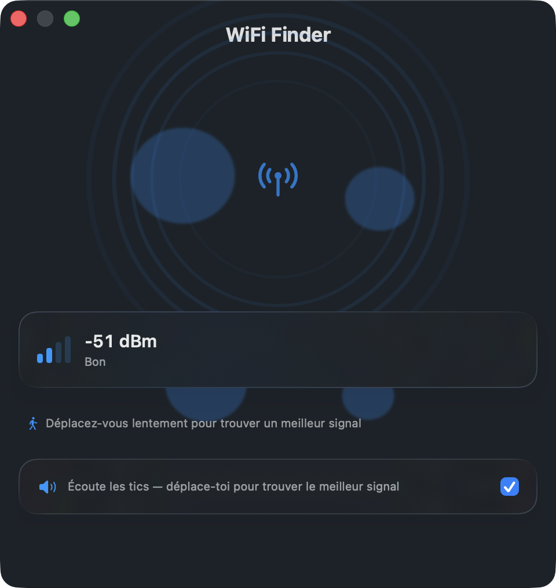
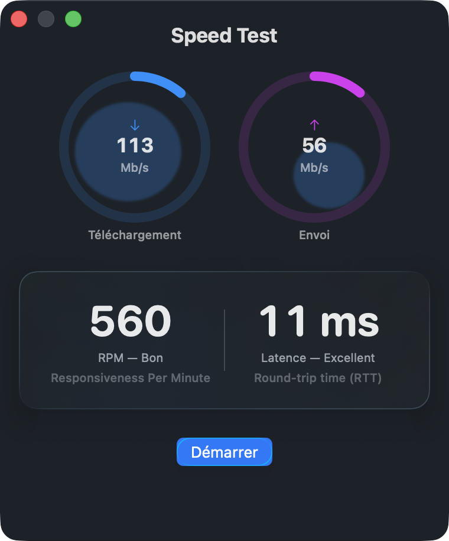
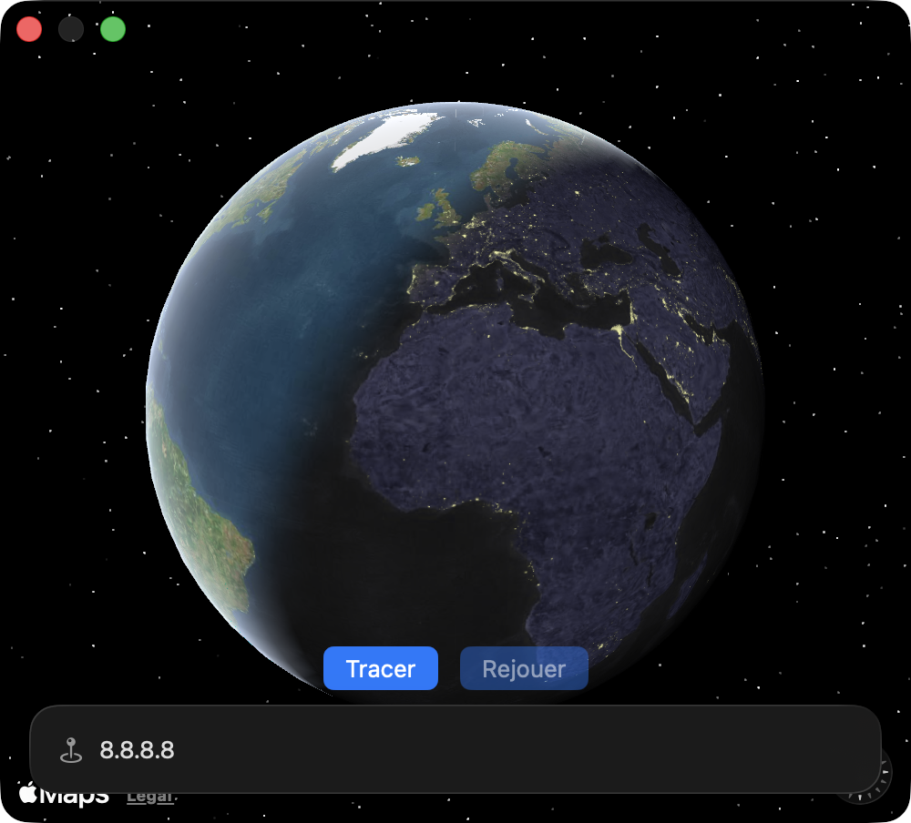
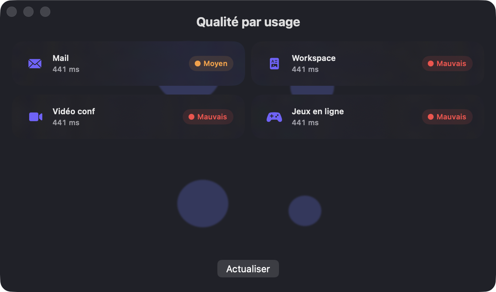

<div align="center">

# NetCheck

**A native macOS menu bar app to monitor your network in real time.**

Sit in your menu bar. Green when online, orange when degraded, red when down.
Click to open WiFi Finder, Speed Test, Traceroute, or Usage Quality.

[](https://www.apple.com/macos)
[](https://github.com/vincentlauriat/NetCheck/releases/latest)
[](https://swift.org)
[](LICENSE)

<br/>

*Walk toward your router · measure your connection · trace every hop · know what your network can handle*

<br/>

| WiFi Finder | Speed Test | Traceroute | Usage Quality |
|:-----------:|:----------:|:----------:|:-------------:|
|  |  |  |  |
| Geiger-counter sound guides you to the strongest WiFi spot | Download, upload, RPM and ping latency via Apple's engine | Animated 3D globe — camera flies to each hop then zooms out | Single latency mapped to hierarchical thresholds per use case |

</div>

---

## Features

| | |
| --- | --- |
| 🌐 **Globe icon** | Green / orange / red connectivity indicator, always visible in the menu bar |
| 📡 **WiFi Finder** | Walk around with Geiger-counter sound and concentric waves — find the strongest spot |
| ⚡ **Speed Test** | Download, upload, RPM and latency via Apple's `networkQuality` engine |
| 🗺️ **Traceroute** | Animated 3D globe — camera flies from space to each hop, then zooms back out |
| 📊 **Usage Quality** | Single latency measurement mapped to hierarchical thresholds (mail → gaming) |
| ⚙️ **Preferences** | Launch at login via `SMAppService`, Sparkle auto-updates |

## Install

Grab the latest `.dmg` from the [Releases page](https://github.com/vincentlauriat/NetCheck/releases/latest), mount it, and drag `NetCheck.app` to `/Applications`.

**Requirements:** macOS 26 or later.

Releases are signed with an Apple Developer ID, built with the Hardened Runtime, and notarized by Apple — they open without any Gatekeeper warning.

## Build from source

**Requirements:** macOS 26+, Xcode 16+, [XcodeGen](https://github.com/yonaskolb/XcodeGen).

```bash
brew install xcodegen
git clone https://github.com/vincentlauriat/NetCheck.git
cd NetCheck
xcodegen generate
open NetCheck.xcodeproj
```

Or use the build script:

```bash
./Scripts/build.sh run   # build Debug + launch
```

## Architecture

Three targets, strict Swift 6 concurrency, no sandbox:

| Target | Role |
| --- | --- |
| `NetCheckCore` | Network logic — actors, async/await, zero UI |
| `NetCheckUI` | Shared SwiftUI components — Liquid Glass panels, `OrganicBubble`, `FeatureWindowBackground` |
| `NetCheck` | App assembly — `NSStatusItem`, `WindowManager`, feature views |

See [ARCHITECTURE.md](ARCHITECTURE.md) for the full design.

## License

MIT © 2026 Vincent Lauriat — see [LICENSE](LICENSE).
